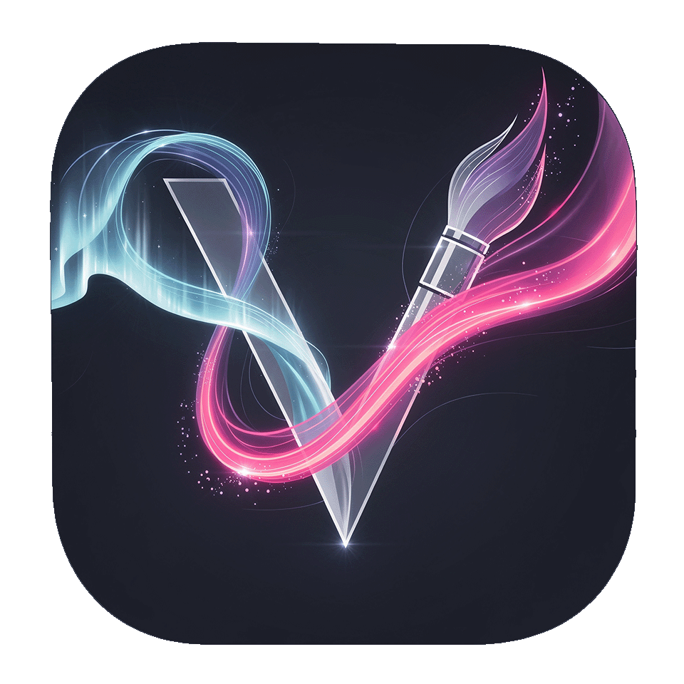

<div align="center">



# ImageVibe

**Десктопное приложение для генерации изображений с помощью ИИ**

<br />

`13 моделей` &nbsp;&middot;&nbsp; `Aurora UI` &nbsp;&middot;&nbsp; `Двусторонний перевод` &nbsp;&middot;&nbsp; `Контроль расходов`

<br />

<a href="#-возможности">Возможности</a> &nbsp;&middot;&nbsp;
<a href="#-модели">Модели</a> &nbsp;&middot;&nbsp;
<a href="#-установка">Установка</a> &nbsp;&middot;&nbsp;
<a href="#-как-пользоваться">Как пользоваться</a> &nbsp;&middot;&nbsp;
<a href="#-горячие-клавиши">Горячие клавиши</a> &nbsp;&middot;&nbsp;
<a href="#-стек-технологий">Стек</a>

</div>

<br />

---

## Что такое ImageVibe?

ImageVibe — десктопное приложение для генерации изображений через [OpenRouter](https://openrouter.ai). Пишите промпт на русском или английском, выбирайте модель и получайте результат — всё в одном красивом интерфейсе с Aurora-темой.

**Чем отличается от аналогов:**

- **13 моделей в одном окне** — от быстрых черновиков до 4K-шедевров, 5 провайдеров
- **Двусторонний перевод RU ↔ EN** — пишите на русском, промпт автоматически переводится на английский; результаты AI-действий переводятся обратно на русский
- **Контроль расходов** — лимиты бюджета, аналитика по моделям, оценка стоимости до генерации
- **Два режима работы** — простой для новичков, расширенный для полного контроля
- **PNG-метаданные** — каждое изображение хранит параметры генерации внутри файла

<br />

## ✦ Возможности

### Генерация
- Режимы: текст→фото, фото→фото, инпейнт
- 36 стилевых тегов в 4 категориях (стиль, качество, освещение, настроение)
- 6 шаблонов негативных промптов
- AI-ассистент: генерация, улучшение, перефразирование промптов
- Двусторонний автоперевод RU ↔ EN с превью
- Пакетная генерация (x2 / x4 / x8 вариаций)
- История промптов с отменой/повтором

### Галерея
- Сетка изображений с поиском и фильтрацией
- Сортировка по дате, стоимости, размеру файла
- Фильтры по модели и избранному
- Полноэкранный просмотр с панелью метаданных
- Навигация стрелками, горячие клавиши
- Коллекции для организации изображений
- Авто-тегирование (27 правил извлечения)

### Расходы и аналитика
- Счётчик расходов в реальном времени в сайдбаре
- Лимиты бюджета (день / неделя / месяц) с предупреждениями
- Дашборд аналитики с разбивкой по моделям
- Предварительная оценка стоимости перед генерацией
- Раздельный учёт: генерация + AI-промпт + перевод

### Интерфейс
- Aurora-тема с анимированными градиентами
- Glass morphism панели с размытием фона
- Палитра команд (Ctrl+K) с нечётким поиском
- 8 встроенных пресетов генерации
- Кастомные тултипы в стиле приложения
- Иконки Lucide React по всему интерфейсу
- Онбординг при первом запуске
- Тост-уведомления

<br />

## ✦ Модели

| Категория | Модель | Провайдер | Для чего |
|-----------|--------|-----------|----------|
| **Быстрые** | FLUX.2 Klein | Black Forest Labs | Быстрые черновики |
| | Riverflow V2 Fast | Sourceful | Быстрая генерация со шрифтами |
| | Gemini 3.1 Flash | Google | Про-качество на скорости Flash |
| | Gemini 2.5 Flash | Google | Бюджетный вариант |
| **Качественные** | FLUX.2 Pro | Black Forest Labs | Баланс скорости и качества |
| | FLUX.2 Max | Black Forest Labs | Максимальное качество |
| | FLUX.2 Flex | Black Forest Labs | Типографика, мульти-референсы |
| | Seedream 4.5 | ByteDance | Портреты, мелкий текст |
| | Riverflow V2 Pro | Sourceful | SOTA, шрифты, суперразрешение |
| | Riverflow V2 Max | Sourceful | Превью максимального качества |
| **Умные** | Gemini 3 Pro | Google | 2K/4K, локальные правки |
| | GPT-5 Image | OpenAI | Рассуждение + генерация |
| | GPT-5 Image Mini | OpenAI | Быстрая умная генерация |

<br />

## ✦ Установка

### Что понадобится
- [Node.js](https://nodejs.org/) 18+
- [API-ключ OpenRouter](https://openrouter.ai/keys)

### Запуск из исходников

```bash
git clone https://github.com/Vento741/ImageVibe.git
cd ImageVibe
npm install
npm run dev
```

### Сборка установщика

```bash
npm run build:exe
```

Готовый `ImageVibe Setup X.X.X.exe` появится в папке `release/`.

<br />

## ✦ Как пользоваться

1. **Первый запуск** — введите API-ключ OpenRouter в диалоге онбординга
2. **Напишите промпт** — на русском или английском (перевод автоматический в обе стороны)
3. **Выберите стиль** — кликните теги или выберите пресет
4. **Генерируйте** — нажмите `Ctrl+Enter` или кнопку
5. **Просматривайте** — результат на Canvas, переключение на сетку 2x2 для вариаций

### Простой режим (по умолчанию)
Промпт + стилевые теги + пропорции + кнопка генерации. Больше ничего не нужно.

### Расширенный режим (Ctrl+Shift+M)
Полный контроль: выбор модели, негативные промпты, пакетная генерация, пресеты, очередь, режим фото→фото, управление seed.

<br />

## ✦ Горячие клавиши

| Клавиша | Действие |
|---------|----------|
| `Ctrl+Enter` | Генерация |
| `Ctrl+K` | Палитра команд |
| `Ctrl+Shift+M` | Простой / расширенный режим |
| `Ctrl+G` | Перейти к генерации |
| `Ctrl+L` | Перейти в галерею |
| `Ctrl+,` | Настройки |
| `Ctrl+R` | Случайный seed |
| `Ctrl+D` | Дублировать генерацию |
| `?` | Все горячие клавиши |
| `Esc` | Закрыть просмотр / палитру |
| `←` `→` | Навигация по галерее |
| `I` | Показать информацию |
| `F` | В избранное |

<br />

## ✦ Стек технологий

| Слой | Технология |
|------|-----------|
| Рантайм | Electron 33 |
| Фронтенд | React 19 + TypeScript 5.9 |
| Сборка | Vite 8 |
| Стили | Tailwind CSS v4 |
| Анимации | Framer Motion |
| Иконки | Lucide React |
| Стейт | Zustand |
| База данных | SQLite (better-sqlite3, WAL, FTS5) |
| Поиск | Fuse.js |
| API | OpenRouter |
| Установщик | electron-builder (NSIS) |

<br />

## ✦ Структура проекта

```
src/
  modules/
    generate/        # Генерация изображений (10 компонентов)
    gallery/         # Сетка, фильтры, просмотр
    collections/     # Коллекции пользователя
    cost/            # Виджет расходов
    queue/           # Очередь генерации
    compare/         # A/B слайдер, сетка вариаций
    presets/         # Селектор пресетов
    analytics/       # Дашборд расходов
    settings/        # API-ключи, бюджет, настройки
    command-palette/ # Поиск Ctrl+K
  shared/
    components/      # UI: Aurora, Glass, Toast, Sidebar, Tooltip
    lib/             # IPC-мост, утилиты
    types/           # TypeScript типы
    hooks/           # Хуки (горячие клавиши)
    stores/          # Toast store

electron/
  main.ts            # Главный процесс Electron
  preload.ts         # Context bridge
  services/          # Бэкенд-сервисы (9 файлов)
  ipc/               # IPC-обработчики
```

<br />

## Лицензия

ISC
